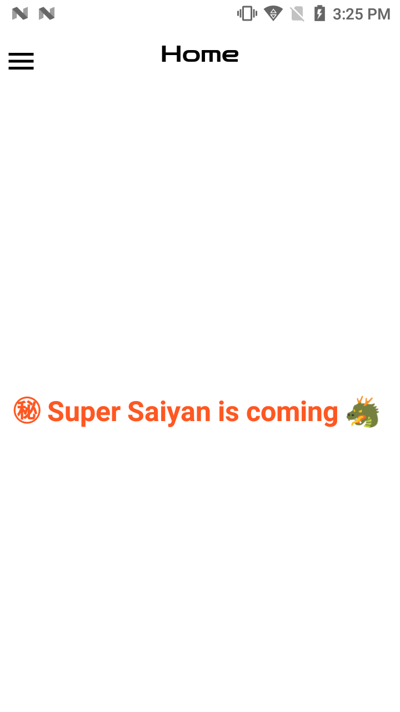
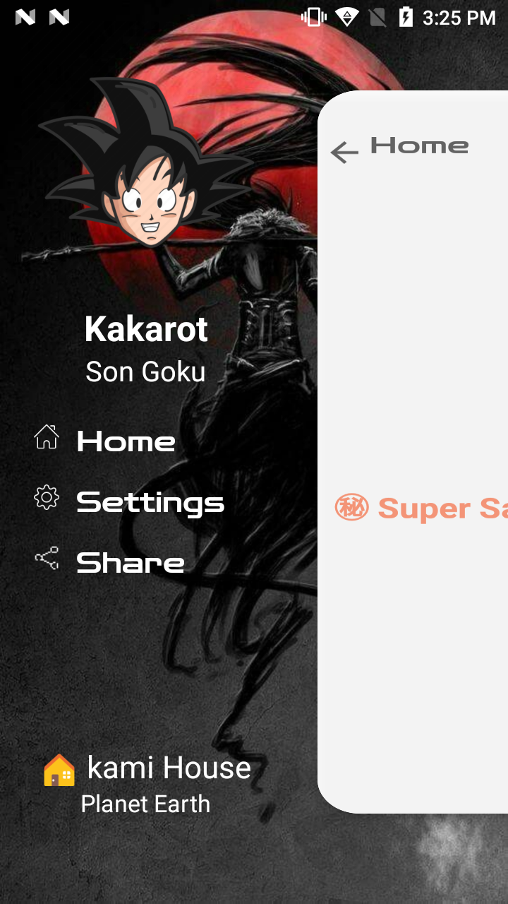

<h2 align="center"><b>Inner Drawer</b></h2>
<h4 align="center">Inner Drawer is a custom Navigation Drawer.</h4>

<h3 align="center">**Star :star:  this repo to show your support and it really does matter!** :clap:</h4>

## Demo

## Description

Inner Drawer is a highly customizable navigation drawer which is super easy to implement. 

### Features

* Add Background Image to drawer layout
* Add custom Header and Footer view
* Add custom menu item and customize them
* Set menu item gravity
* Add gif as menu icon
* Smooth open and close transition
* Animated Toolbar
* Manage status bar icon color
* Blur main content
* Interactive and Easy UI.

### Technologies used
* Kotlin
* 
<a href="https://github.com/koral--/android-gif-drawable">android-gif-drawable</a>
 

## Contribution
Your ideas, design changes, or any help is always welcome. The more is contribution the better it gets.

 
