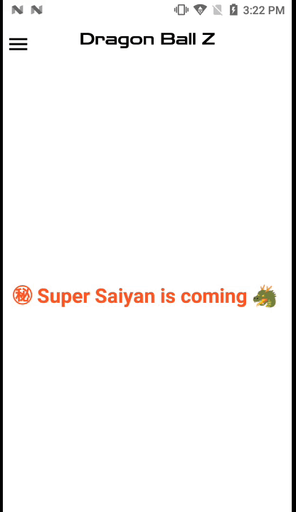

<h2 align="center"><b>Inner Drawer</b></h2>
<h4 align="center">Inner Drawer is a custom Navigation Drawer.</h4>
<p align="center">
<a alt="GitHub release"></a>
<a href="/LICENSE" alt="License: GPLv3"></a>
<a href="https://github.com/Darkprnce/InnerDrawer" alt="Build Status"></a>
</p>
<hr>

<h3 align="center">**Star :star:  this repo to show your support and it really does matter!** :clap:</h4>

## Demo

[](screenshots/demo.gif)

[](screenshots/Screenshot_1.png)
[](screenshots/Screenshot_2.png)


## Description

Inner Drawer is a highly customizable navigation drawer which is super easy to implement. 

### Features

* Add Background Image to drawer layout
* Add custom Header and Footer view
* Add custom menu item and customize them
* Set menu item gravity
* Add gif as menu icon
* Smooth open and close transition
* Animated Toolbar
* Manage status bar icon color
* Blur main content
* Interactive and Easy UI.

### Technologies used
* Kotlin
* <p align="left"><a href="https://github.com/koral--/android-gif-drawable">android-gif-drawable</a></p> 

### Installation

* **Gradle**

	Add it in your root settings.gradle at the end of repositories:
	```gradle
  repositories {
        mavenCentral()
    }
	```

	Add the dependency in your app build.gradle
	```gradle
  dependencies { 
	        implementation 'io.github.Darkprnce:InnerDrawer:1.0.2'
	}
	```

### Usage

Drop the Inner Drawer in your XML layout as is shown below:
```xml
    <com.innerdrawer.Ui.InnerDrawer
        android:id="@+id/nav_view"
        android:layout_width="match_parent"
        android:layout_height="match_parent">

        <include
            android:id="@+id/ll_dashboard"
            layout="@layout/app_bar_dashboard"
            android:layout_width="match_parent"
            android:layout_height="match_parent" />
    </com.innerdrawer.Ui.InnerDrawer>
```
And then in your Activity
```kotlin
        //Global Declaration
        private lateinit var dashboard_binding: ActivityDemoBinding
        private lateinit var header_binding: NavHeaderMainBinding
        private lateinit var mContext: Context
        
        //Inside onCreate()
        
        dashboard_binding = ActivityDemoBinding.inflate(layoutInflater)
      
        val view = dashboard_binding.root
        setContentView(view)
        mContext = this@DemoActivity
        
        //setting menu
        
        //set blur on main content when drawer is open
        dashboard_binding.navView.setBlurContentEnabled(true)

        //set default appbar
        dashboard_binding.navView.setAppBarEnabled(true)

        // set appbar color
        dashboard_binding.navView.setNavIconColor(ContextCompat.getColor(mContext, R.color.black))

        //set appbar title
        dashboard_binding.navView.setAppbarTitle("Dragon Ball Z")

        // set appbar color
        dashboard_binding.navView.setAppbarColor(ContextCompat.getColor(mContext, R.color.white))

        //set appbar title color
        dashboard_binding.navView.setAppbarTitleTextColor(
            ContextCompat.getColor(
                mContext,
                R.color.black
            )
        )

        //set appbar title font
        val font_a = Typeface.createFromAsset(mContext.assets, "ZenDots-Regular.ttf")
        dashboard_binding.navView.setAppbarTitleTypeface(font_a)

        //if you want to close drawer on menu item click
        dashboard_binding.navView.setCloseDrawerOnMenuClick(true)

        //set footer view
        val footerview: View = LayoutInflater.from(mContext).inflate(R.layout.nav_footer_main, null)
        dashboard_binding.navView.setFooterView(footerview)

        //set header view
        val headerview: View = LayoutInflater.from(mContext).inflate(R.layout.nav_header_main, null)
        dashboard_binding.navView.setHeaderView(headerview)

        //set footer inside menu list
        dashboard_binding.navView.setFooterInside(false)

        //set header inside menu list
        dashboard_binding.navView.setHeaderInside(false)

        //set drawer background color
        dashboard_binding.navView.setNavigationDrawerBackgroundColor(R.color.white)

        //set menu item text color
        dashboard_binding.navView.setMenuItemTextColor(
            ContextCompat.getColor(
                mContext,
                R.color.white
            )
        )

        //set menu item text size
        dashboard_binding.navView.setmenuItemTextSize(20f)

        //set menu item gravity
        dashboard_binding.navView.setMenuItemGravity(Gravity.TOP)

        // set font for menu items
        val font = Typeface.createFromAsset(mContext!!.assets, "ZenDots-Regular.ttf")
        dashboard_binding.navView.setmenuItemFont(font)


        //set status bar icon color
        dashboard_binding.navView.setstatusbarIconDark(true)

        //set main content shrink value
        dashboard_binding.navView.setshrinkValue(0.8f)

        // open drawer
        dashboard_binding.navView.openDrawer()

        //close drawer
        dashboard_binding.navView.closeDrawer()

        //set background image to drawer
        dashboard_binding.navView.setBackgroundItem(
            BitmapFactory.decodeResource(
                resources,
                R.drawable.nav_bg
            )
        )


        //create menu list
        val menuItems: ArrayList<NavMenuItem> = ArrayList()
        menuItems.add(NavMenuItem("Home", R.drawable.home_icon))
        menuItems.add(NavMenuItem("Settings", R.drawable.settings_icon))
        menuItems.add(NavMenuItem("Share", R.drawable.share_icon_small))


        // set menu at last
        dashboard_binding.navView.setMenuItemList(this, menuItems)

        //add menu item dynamically
        dashboard_binding.navView.addMenuItem(NavMenuItem("Test",R.drawable.home_icon))

        //access different menu from title
        dashboard_binding.navView.setOnMenuItemClickListener(object :
            InnerDrawer.OnMenuItemClickListener {
            override fun onMenuItemClicked(title: String) {
                dashboard_binding.navView.setAppbarTitle(title)
                Log.e(TAG, "onMenuItemClicked: " + title)
            }
        })


        //get header view
        header_binding = NavHeaderMainBinding.bind(dashboard_binding.navView.getHeaderView()!!)
        header_binding.txtuserName.text = "Kakarot"
        header_binding.txtuserId.text = "Son Goku"

        //drawer listener
        dashboard_binding.navView.setOnDrawerListener(object : InnerDrawer.DrawerListener {
            override fun onDrawerOpening() {
                Log.d(TAG, "onDrawerOpening: ")
            }

            override fun onDrawerClosing() {
                Log.d(TAG, "onDrawerClosing: ")
            }

            override fun onDrawerOpened() {
                Log.d(TAG, "onDrawerOpened: ")
            }

            override fun onDrawerClosed() {
                Log.d(TAG, "onDrawerClosed: ")
            }

            override fun onDrawerStateChanged(newState: Int) {
                Log.d(TAG, "onDrawerStateChanged: ")
            }
        })

        //Nav Icon listener
        dashboard_binding.navView.setOnNavIconClickListener(object :
            InnerDrawer.OnNavIconClickListener {
            override fun onNavIconClicked() {
                Log.d(TAG, "onHamMenuClicked: ")
            }
        })

```

### Customization


```xml
     <com.innerdrawer.Ui.InnerDrawer
        android:id="@+id/nav_view"
        android:layout_width="match_parent"
        android:layout_height="match_parent"
        app:menuItemGravity="top"
        app:menuItemTextSize="10sp"
        app:menuItemTextColor="@color/white"
        app:menuItemIconColor="@color/white"
        app:closeDrawerOnMenuClick="true"
        app:appBarEnabled="true"
        app:headerLayout="@layout/nav_header_main"
        app:footerlayout="@layout/nav_footer_main"
        app:statusBarDark="true"
        app:shrinkValue="0.8"
        app:appbarColor="@color/white"
        app:appbarTitleTextColor="@color/black"
        app:appbarTitleTextSize="10sp"
        app:blurContent="true"
        app:HamMenuIconTintColor="@color/black">

        <include
            android:id="@+id/ll_dashboard"
            layout="@layout/app_bar_dashboard"
            android:layout_width="match_parent"
            android:layout_height="match_parent" />
    </com.innerdrawer.Ui.InnerDrawer>
      
```

### Developed by
<div class="LI-profile-badge"  data-version="v1" data-size="medium" data-locale="en_US" data-type="horizontal" data-theme="light" data-vanity="tarun-yadvendu"><a class="LI-simple-link" href='https://www.linkedin.com/in/tarun-yadvendu-b6ab5b13a'>Tarun Yadvendu</a></div>

## Contribution
Your ideas, design changes, or any help is always welcome. The more is contribution the better it gets.

<p align="left"><a href="https://www.buymeacoffee.com/darkprnce"></a></p> 
  
### License
```
MIT License

Copyright (c) 2022 Tarun Yadvendu

Permission is hereby granted, free of charge, to any person obtaining a copy
of this software and associated documentation files (the "Software"), to deal
in the Software without restriction, including without limitation the rights
to use, copy, modify, merge, publish, distribute, sublicense, and/or sell
copies of the Software, and to permit persons to whom the Software is
furnished to do so, subject to the following conditions:

The above copyright notice and this permission notice shall be included in all
copies or substantial portions of the Software.

THE SOFTWARE IS PROVIDED "AS IS", WITHOUT WARRANTY OF ANY KIND, EXPRESS OR
IMPLIED, INCLUDING BUT NOT LIMITED TO THE WARRANTIES OF MERCHANTABILITY,
FITNESS FOR A PARTICULAR PURPOSE AND NONINFRINGEMENT. IN NO EVENT SHALL THE
AUTHORS OR COPYRIGHT HOLDERS BE LIABLE FOR ANY CLAIM, DAMAGES OR OTHER
LIABILITY, WHETHER IN AN ACTION OF CONTRACT, TORT OR OTHERWISE, ARISING FROM,
OUT OF OR IN CONNECTION WITH THE SOFTWARE OR THE USE OR OTHER DEALINGS IN THE
SOFTWARE.
